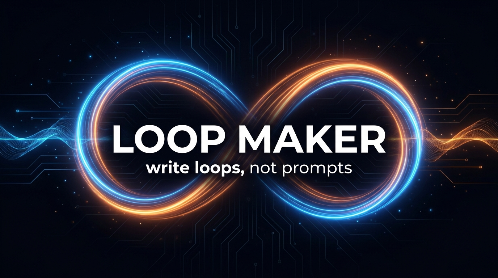

# 🔁 Loop Maker

**The master prompt engineer for overnight autonomous AI runs.**
Tell it what you want in plain English. It writes the whole run: master prompt, plan, verifier, one command. You go to sleep. The AI ships.

**⭐ Star this repo** if your AI ships while you sleep · Built by [AI Guy Official](https://aiguyofficial.com)

---

## Why this exists

Everyone prompts AI coding agents one message at a time, babysitting every step. Then the agent stops after ten minutes, or worse, *says* it's done when it isn't.

The people getting real results stopped writing prompts. They write **loops**: a spec that pins the work, a checker that isn't the writer, and a finish line the agent can actually prove. That's how a single goal prompt built an entire company overnight (product, brand, landing page, launch videos) for about 500K orchestrator tokens, and how practitioners run 7, 9, even 15-hour autonomous Claude Code sessions that ship.

Loop Maker packages that entire playbook — Anthropic's long-running-agent research, the Ralph Wiggum loop, spec-driven development, plan-delegate-review orchestration — into one skill. You describe the goal. It engineers the run.

## What you get from one word

Type `loop`, answer a few questions (one at a time), and it generates:

| File | What it does |
|---|---|
| **Master prompt** (`MISSION.md` / `BUILD-LOOP.md`) | The agent's full instruction set: mission, guardrails, never-ask autonomy rules, orchestration playbook, definition of done |
| **`feature_list.json`** | Every feature with verify steps and `"passes": false` — the agent can't declare victory early |
| **`loop/PROGRESS.md`** | Decision log + honesty buckets (done / blocked / cut) — survives crashes and context limits |
| **`AGENTS.md`** | Portable rules file read natively by Codex, Cursor, Gemini, Copilot (+ Claude Code via one line) |
| **The launch command** | One thing to paste. Then you walk away. |

## ⚡ Install in 60 seconds

### Claude Code (full skill — recommended)
Drop the [`loop-maker/`](loop-maker/) folder into `~/.claude/skills/`, restart Claude Code, then type **`loop`** + what you want. Full instructions: [loop-maker/README.md](loop-maker/README.md)

### Slash command (Claude Code · Codex · Cursor · Antigravity)
One file, [`commands/loop-maker.md`](commands/loop-maker.md), works everywhere. **The command is `/loop-maker`** (not `/loop` — Claude Code already has a built-in `/loop`):

| Agent | Put it here | Then type |
|---|---|---|
| **Claude Code** | `~/.claude/commands/loop-maker.md` | `/loop-maker` |
| **Codex CLI** | `~/.codex/prompts/loop-maker.md` | `/loop-maker` |
| **Cursor** | `.cursor/commands/loop-maker.md` | `/loop-maker` |
| **Antigravity / anything else** | anywhere in the repo | "Read commands/loop-maker.md and follow it" |

Then just talk to it: `/loop-maker I want to add 3 features to my app — build all of them, test everything end to end, and don't stop until it's done.`

**How it feels:** it scans your repo first (so it never asks what it can see), writes a draft mission prompt instantly from whatever you said, and scores it — **Mission Strength: 7/10** — then asks you ONE question at a time (three max) and you watch the score climb. Say "just send it" anytime and it ships the draft with its assumptions logged. At 10/10 you get a **Mission Card**: codename, run-length estimate, the perfect prompt in one copy block, and the launch line. *See you in the morning.* 🌙

## The method (what makes the runs actually finish)

**Three parts, non-negotiable.** The Spec pins exactly what to build and what's out of scope. The Verifier is never the writer — tests, screenshots, or a fresh-context skeptic grade the work. The Stop Condition is provable, with a hard turn/time cap.

**Plan, delegate, review.** The smart model never builds. It orchestrates cheaper worker models — fan-out researchers, tournaments with judge panels, adversarial skeptics, a completeness critic before any phase counts as done. Same results, fraction of the cost.

**Never ask, always log.** The agent doesn't stop to ask questions at 3 AM. It decides with research, logs the question + answer + why in a Decision Log, and keeps moving. Blocked after three attempts? It ships the strong 80% and tells you exactly what got cut. Blocked is never dressed up as done.

**Evidence, not vibes.** Every "it works" comes with the test output, the command result, or the screenshot — verified from the source of truth, never a green badge.

The full playbook lives in [`loop-maker/references/`](loop-maker/references/): [orchestration patterns](loop-maker/references/orchestration-patterns.md) · [17 documented failure modes and their guardrails](loop-maker/references/failure-modes.md) · [the five-gate thinking method](loop-maker/references/fable-method.md) · [launch commands per platform](loop-maker/references/run-commands.md).

## FAQ

**Is this safe to run overnight?** Every generated loop is scoped to one folder/branch, can't push, deploy, publish, send, or spend, and carries a hard cap. The morning review is part of the method: the loop builds, you stay the boss.

**Does it only work for code?** No. Build mode handles features, refactors, bug hunts, migrations, content batches. Venture mode runs the full pipeline: hunt for real pain → tournament-pick the winner → design the business → build brand + product → launch videos → red team → packaged recap.

**What does an overnight run cost?** On a Claude subscription, the plan-delegate-review pattern is the whole trick: the expensive model only orchestrates, cheap models do the building. Scope tight, cap turns, review in the morning.

---

## 🚀 Go deeper

**[Join Evolving AI Hub on Skool](https://www.skool.com/evolving-ai-hub)** — the community where we drop every skill, prompt system, and build like this one, free.

**Want this level of AI systems installed across your whole business?**
That's literally what we do — [**aiguyofficial.com**](https://aiguyofficial.com)

*Loop Maker by [AI Guy Official](https://aiguyofficial.com) · MIT License · PRs welcome*

